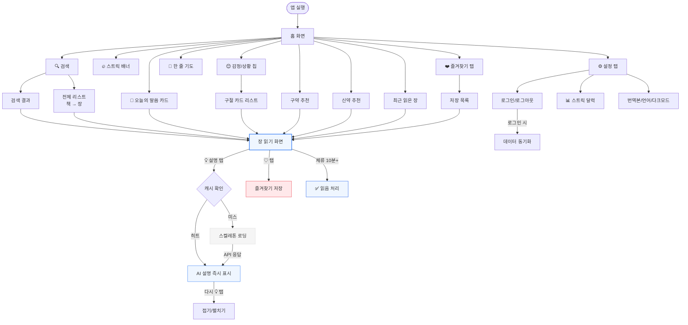
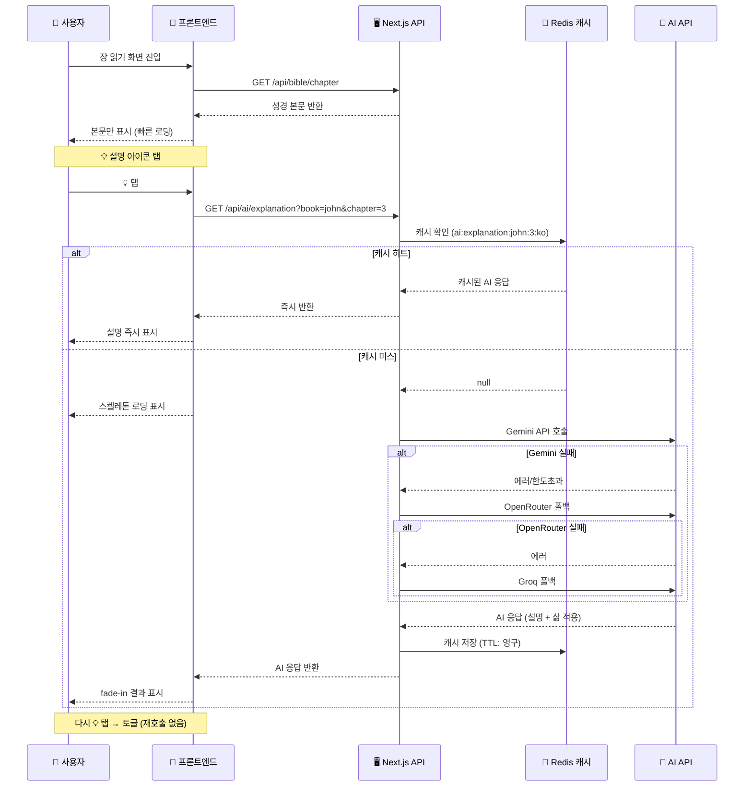
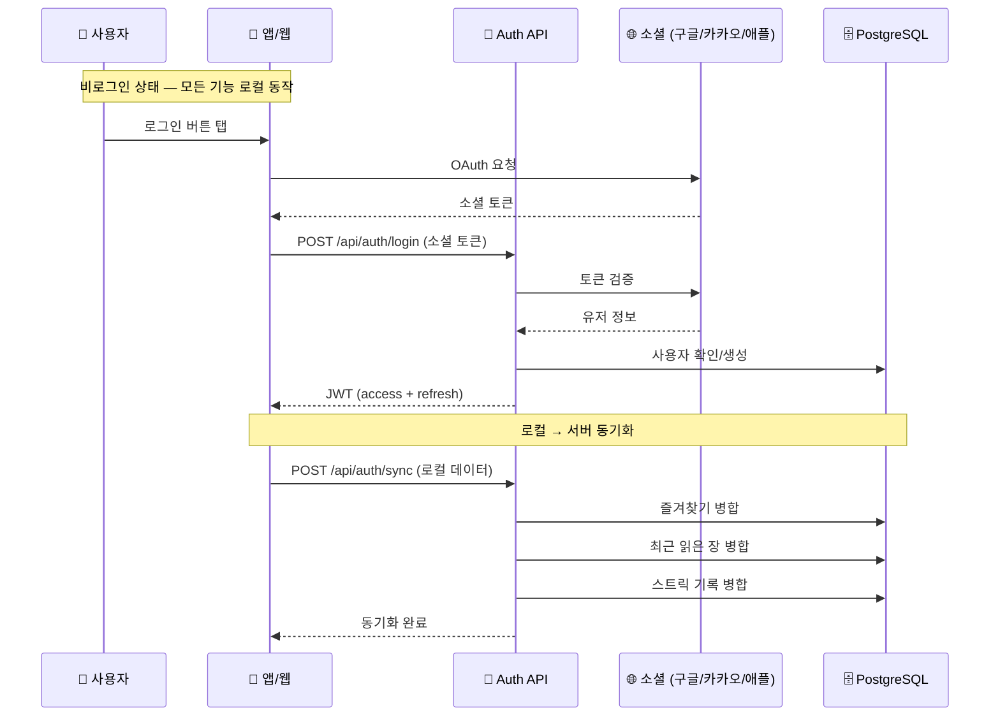
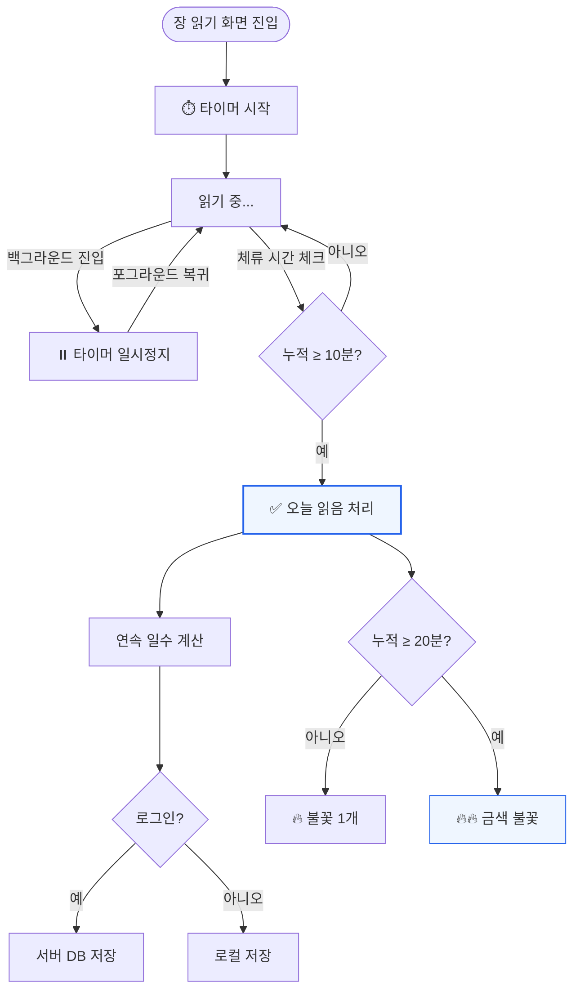
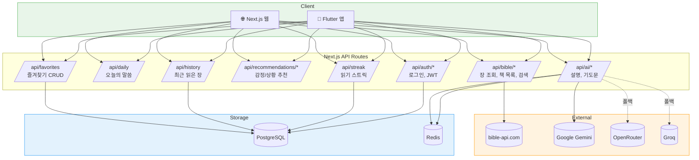

# BibleSsam 전체 플로우

> 자동 생성됨 — `scripts/generate-deliverables.sh`

---

## 1. 사용자 전체 플로우 (User Journey)



---

## 2. AI 설명 On-Demand 호출 플로우



---

## 3. 인증 & 데이터 동기화 플로우



---

## 4. 읽기 스트릭 플로우



---

## 5. 데이터 저장 플로우

```mermaid
flowchart LR
    subgraph 비로그인
        LOCAL_FAV[즐겨찾기<br/>localStorage]
        LOCAL_RECENT[최근 읽은 장<br/>localStorage]
        LOCAL_STREAK[스트릭<br/>localStorage]
        LOCAL_AI[AI 설명 캐시<br/>localStorage]
    end

    subgraph 서버 (로그인 시)
        DB_FAV[(즐겨찾기<br/>PostgreSQL)]
        DB_RECENT[(최근 읽은 장<br/>PostgreSQL)]
        DB_STREAK[(스트릭<br/>PostgreSQL)]
        REDIS_AI[(AI 캐시<br/>Redis)]
    end

    LOCAL_FAV -.->|로그인 시 동기화| DB_FAV
    LOCAL_RECENT -.->|로그인 시 동기화| DB_RECENT
    LOCAL_STREAK -.->|로그인 시 동기화| DB_STREAK
    LOCAL_AI -.->|서버 캐시와 별도| REDIS_AI

    style 비로그인 fill:#F0F8FF,stroke:#4A90D9
    style 서버 fill:#EFF6FF,stroke:#3B82F6
```

---

## 6. API 아키텍처


